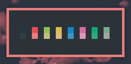

# Roseblossom

Another custom colorscheme I created

# Colors
## Dark
suitable for nearly anything.
| **Color** | **Hex value** | **Preview** |
| ----- | ---------  | ------- |
| Background | #2B3339 |  |
| Foreground | #EDE1E1 |  |
| Black | #243740 |  |
| Light Black | #323C41 |  |
| Red | #E65050 |  |
| Light Red | #E67E7E |  |
| Green | #92BF5A |  |
| Light Green | #BFBF80 |  |
| Yellow | #DBBC53 |  |
| Light Yellow | #DBBA7F |  |
| Blue | #1286C4 |  |
| Light Blue | #3A94C5 |  |
| Purple | #D66DA2 |  |
| Light Purple | #D698B7 |  |
| Cyan | #14A673 |  |
| Light Cyan | #35A77C |  |
| Gray | #7BA88A |  |
| Light Gray | #9DA9A0 |  |

# Screenshots
